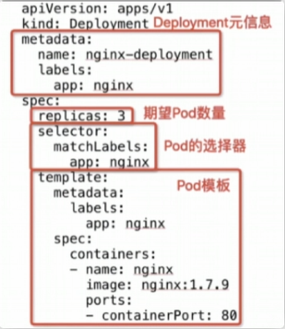

## k8s 面试总结
### k8s 有哪些组件  有什么作用
Kubernetes（简称 K8s）是一个用于自动化部署、扩展和管理容器化应用程序的开源平台。它具有以下几个组件：

- Master

Master 组件是 Kubernetes 系统中的控制节点，负责管理整个 Kubernetes 集群。它主要包括三个组件：

1. etcd：一个分布式键值对存储系统，用于存储整个 Kubernetes 集群的状态信息。
2. kube-apiserver：Kubernetes API 服务器，提供与整个 Kubernetes 集群的交互。
3. kube-controller-manager：负责管理 Kubernetes 中的控制器，例如 Node、Service、Replication Controller 等。
4. kube-schedule: 调度器根据特定的调度算法和调度策略将 Pod 调度到合适的 Node节点上去 可以理解为为Pod选择最合适的Node。

- Node

Node 是 Kubernetes 集群中的计算节点，负责运行 Docker 容器和负载均衡服务。它主要包括以下几个组件：

1. kubelet：负责维护 Pod 的生命周期、容器和镜像的管理等。
2. kube-proxy：实现 Kubernetes Service 中的网络代理和负载均衡。
3. Container Runtime：容器运行环境， 目前支持 Docker 和 rtx。

- Addons

Addons 是 Kubernetes 的可选组件，它们为 Kubernetes 集群提供了额外的功能和特性。几个常见的 Addons 组件包括：

1. DNS：为 Kubernetes 集群提供 DNS 服务。
2. Dashboard：为 Kubernetes 集群提供 Web 界面管理工具。
3. Ingress Controller：为 Kubernetes 集群提供 Ingress 控制器，支持 HTTP 和 HTTPS 访问。

- Volume

Volume 是 Kubernetes 中的一种资源类型，它允许将数据存储到独立于某个 Pod 的储存介质中。Kubernetes 提供了多种类型的 Volume，包括：

1. emptyDir：设置为容器持久化数据的本地数据空间。
2. hostPath：使用主机上的文件系统路径作为 Pod 的 Volume。
3. NFS：使用 Network File System（NFS）作为 Kubernetes 中的 Volume 管理器。

总的来说，Kubernetes 及其组件为容器化应用程序的部署、管理和自动化提供了广泛的支持和能力，并可以在不同的环境中使用和扩展。

### k8s 和 docker 的关系
Docker是轻量级的沙盒，相对于传统虚拟化来说的话没有虚拟、独立的操作系统，在其中运行的只是应用。

然后k8s是一个容器编排的工具 + 有哪些组件

服务发现及负载均衡这个k8s自带，Kubernetes为容器提供了自己的IP地址和一组容器的单个DNS名称，并可以在它们之间进行负载均衡。

这里我补充下，有支持第三方开发operator的能力

K8S还能根据自定义的策略，不需要停机来更新应用

自动修复，能够保证应用的稳定性，通过检测和失败修复，重启不健康的容器等方法

### kube-proxy 的作用
kube-proxy 是 Kubernetes 中的一个组件，主要负责实现 Kubernetes 集群中的服务发现和负载均衡。其主要功能包括：

1. **服务代理**：kube-proxy负责为 Kubernetes 集群中的服务创建代理，并确保集群内部和外部的网络流量能够正确地路由到服务的后端Pod。

2. **负载均衡**：kube-proxy可以实现基于轮询、IP Hash等算法的负载均衡，将流量均匀地分发到多个后端Pod上，以提高服务的可用性和性能。

3. **服务发现**：kube-proxy通过监视 Kubernetes API Server 中的服务和端点对象来维护服务的网络规则，以便正确地将流量路由到服务的实际后端Pod。

4. **网络代理**：kube-proxy还可以实现网络地址转换（NAT）和端口转发，以确保在集群内和集群外正确地处理流量。

总的来说，kube-proxy在 Kubernetes 集群中扮演着重要的角色，帮助实现服务发现、负载均衡和网络代理等功能，确保集群中的服务能够正常运行并被外部访问。

### pod 可能处于的状态
在 Kubernetes 中，Pod 可能处于以下几种状态：

1. **Pending（等待中）**：Pod 已被创建，但尚未被调度到节点上运行。这可能是因为节点资源不足、调度限制或其他原因导致 Pod 无法立即运行。

2. **Running（运行中）**：Pod 已经被调度到节点上并且正在运行中，所有容器也都在运行。

3. **Succeeded（成功）**：Pod 中的所有容器已成功完成任务并退出。这种状态通常发生在一次性任务或者完成性质的任务结束后。

4. **Failed（失败）**：Pod 中的一个或多个容器已经退出，并且至少有一个容器的退出状态是非零。这表明容器内部发生了错误或者任务执行失败。

5. **Unknown（未知）**：Kubernetes 无法获取 Pod 的当前状态，通常是由于与节点通信失败导致的。

6. **Terminating（终止中）**：Pod 正在被删除，其中的容器正在被终止。这可能是由于用户删除 Pod 或者控制器调整副本数导致的。

7. **ContainerCreating（容器创建中）**：Pod 已经被调度，但容器正在创建中。这通常发生在容器镜像下载或其他初始化过程中。

8. **ContainerCreating（容器创建中）**：Pod 已经被调度，但容器正在创建中。这通常发生在容器镜像下载或其他初始化过程中。

了解 Pod 的不同状态有助于管理员和开发人员更好地监控和管理 Kubernetes 集群中的工作负载。

### pod 重启策略
在 Kubernetes 中，可以通过设置 Pod 的重启策略来定义在容器失败时 Kubernetes 如何处理 Pod 的行为。主要的重启策略包括：

1. **Always（始终重启）**：这是默认的重启策略。当容器失败时，Kubernetes 将始终尝试重新启动容器，直到容器成功运行为止。

2. **OnFailure（失败时重启）**：在这种策略下，只有当容器以非零状态退出时才会重启容器。如果容器正常退出（退出状态为0），则不会重启。

3. **Never（永不重启）**：在这种策略下，当容器退出时，无论退出状态是什么，Kubernetes 都不会尝试重新启动容器。

重启策略可以在 Pod 的规范（spec）中进行定义，如下所示：

```yaml
spec:
  restartPolicy: Always
```

通过设置不同的重启策略，可以根据应用程序的需求来定义容器失败时的行为，以确保应用程序在发生故障时能够按照预期的方式进行恢复。

### 常见的 Pod调度方式
在 Kubernetes 中，有几种常见的 Pod 调度方式，可以根据集群的需求和资源情况选择合适的调度方式。以下是一些常见的 Pod 调度方式：

1. **默认调度器（Default Scheduler）**：Kubernetes 默认提供的调度器，负责将 Pod 调度到集群中的节点上。默认调度器考虑节点的资源利用率、Pod 的资源需求、亲和性和反亲和性规则等因素来进行调度决策。

2. **节点亲和性调度（Node Affinity）**：通过节点亲和性调度，可以指定 Pod 只能调度到满足特定标签要求的节点上。这样可以确保某些 Pod 只会被调度到特定类型的节点上。

3. **Pod 亲和性调度（Pod Affinity）**：通过 Pod 亲和性调度，可以指定 Pod 只能调度到与其他 Pod 共同运行的节点上。这有助于将相关的服务或应用程序部署在相同的节点上，以减少网络延迟等问题。

4. **Pod 反亲和性调度（Pod Anti-Affinity）**：与 Pod 亲和性相反，Pod 反亲和性调度可以指定 Pod 不应该调度到与其他 Pod 共同运行的节点上。这有助于提高容错性和可靠性，避免将相关的服务部署在同一节点上。

5. **手动调度（Manual Scheduling）**：在某些情况下，用户可能希望手动将 Pod 调度到特定的节点上。可以通过指定节点名称或者节点标签来实现手动调度。

6. **自定义调度器（Custom Scheduler）**：除了默认调度器外，Kubernetes 还支持用户自定义调度器。用户可以根据自己的需求编写自定义调度器，实现特定的调度策略。

这些不同的 Pod 调度方式可以根据实际需求和场景来选择和组合，以实现最佳的资源利用率、性能和可靠性。

### deployment
deployment 对象控制 replicaset 版本，而 replicaset 控制集群中 pod 的数量


deployment的配置



deployment 主要是通过label来识别pod的

#### 常见操作
创建服务: kubectl apply -f nginx.yaml

删除服务: kubectl delete -f nginx.yaml

扩容: kubectl scale deployment nginx--replicas 10

升级: kubectl set image deployment/nginx nginx=nginx:1.9.4

回滚: kubectl rollout undo deployment/nginx

其中可以用 kubectl get deployment 可以看到所有deployment集群

kubectl get pods 可以看到所有的pod 然后看到 deployment 集群的pods会自动带上一些字符串后缀进行区分

#### 更新策略
在 spec.strategy 中定义更新策略，两种方式:
- Recreate: 所有 Pod 杀掉再更新
- RollingUpdate: 滚动更新pod;spec.strategy.rolingUpdate.maxUnavailable用于指定更新过程中不可用状态的Pod数量的上限;spec.strategy.rolingUpdate.maxSurge用于指定更新过程中pod总数量超过期望数量的部分的最大值

#### deployment 和 service的区别
在 Kubernetes 中，Deployment 和 Service 是两个核心概念，分别用于管理应用程序的部署和实现服务发现与负载均衡。它们的主要区别如下：

1. **Deployment（部署）**：
    - **作用**：Deployment 用于定义应用程序的部署方式，确保应用程序的副本数量符合预期，并提供滚动更新和回滚功能。Deployment 控制 Pod 的创建和更新过程，确保应用程序持续处于所需的状态。
    - **特点**：Deployment 通过定义 Pod 模板、副本数量、更新策略等参数来管理应用程序的部署，使得应用程序的部署和更新过程更加可控和稳定。

2. **Service（服务）**：
    - **作用**：Service 用于定义一组 Pod 的访问方式，为应用程序提供稳定的网络端点。Service 允许外部客户端或其他应用程序通过 Service 访问应用程序，同时实现负载均衡和服务发现。
    - **特点**：Service 可以将一组具有相同标签的 Pod 组合成一个服务，并为这些 Pod 提供一个虚拟 IP 地址和稳定的 DNS 名称，以便其他应用程序可以通过该地址访问这些 Pod。

总结：
- Deployment 主要用于管理应用程序的部署和更新，确保应用程序的副本数量和状态符合预期。
- Service 主要用于实现服务发现和负载均衡，为一组 Pod 提供一个稳定的网络端点，使得应用程序可以被其他应用程序或外部客户端访问。

在实际应用中，通常会同时使用 Deployment 和 Service 来管理应用程序的部署和对外提供服务，以实现应用程序的高可用性、可伸缩性和稳定性。

### 数据包传输
在 Kubernetes 中，Pod 到 Service 和 Service 到 Pod 的数据包传输过程涉及到 Service 的负载均衡和代理功能。以下是 Pod 到 Service 和 Service 到 Pod 的数据包传输过程：

#### Pod 到 Service 的数据包传输过程：
1. **Pod 发送数据包**：当 Pod 需要与 Service 进行通信时，Pod 发送数据包到 Service 的 ClusterIP（Service 的虚拟 IP 地址）。

2. **Service 的负载均衡**：Service 接收到数据包后，根据 Service 的类型（如 ClusterIP、NodePort、LoadBalancer）和负载均衡策略，将数据包转发到后端的一个或多个 Pod 上。

3. **Pod 接收数据包**：数据包最终被转发到后端 Pod，后端 Pod 处理数据包并做出相应的响应。

#### Service 到 Pod 的数据包传输过程：
1. **外部请求到达 Service**：当外部客户端或其他 Pod 需要访问 Service 时，请求首先到达 Service 的虚拟 IP 地址。

2. **Service 的负载均衡**：Service 接收到请求后，根据负载均衡策略将请求转发到后端的一个或多个 Pod 上。

3. **Pod 接收请求**：请求被转发到后端 Pod，后端 Pod 处理请求并生成相应的响应。

4. **响应返回给 Service**：后端 Pod 生成响应后，将响应返回给 Service。

5. **Service 返回给请求方**：Service 将后端 Pod 的响应返回给请求方，完成整个数据传输过程。

在这个过程中，Kubernetes 中的 Service 扮演了负载均衡和服务发现的角色，确保请求能够被正确转发到后端的 Pod 上，实现了应用程序的高可用性和可伸缩性。通过 Service，Pod 可以被抽象为一个服务，而不需要外部客户端或其他应用程序直接与 Pod 进行通信，从而简化了应用程序的网络通信管理。